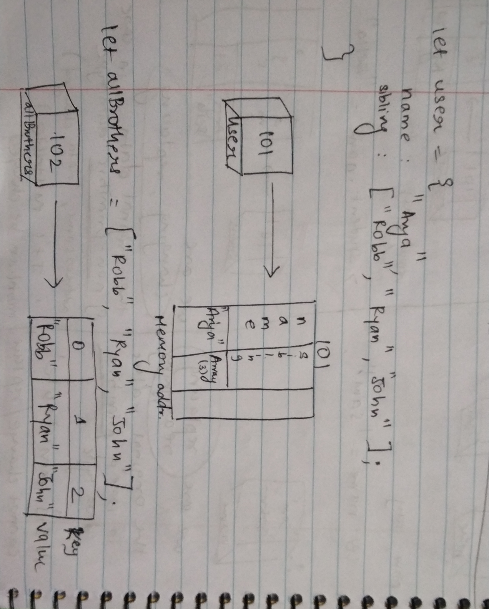
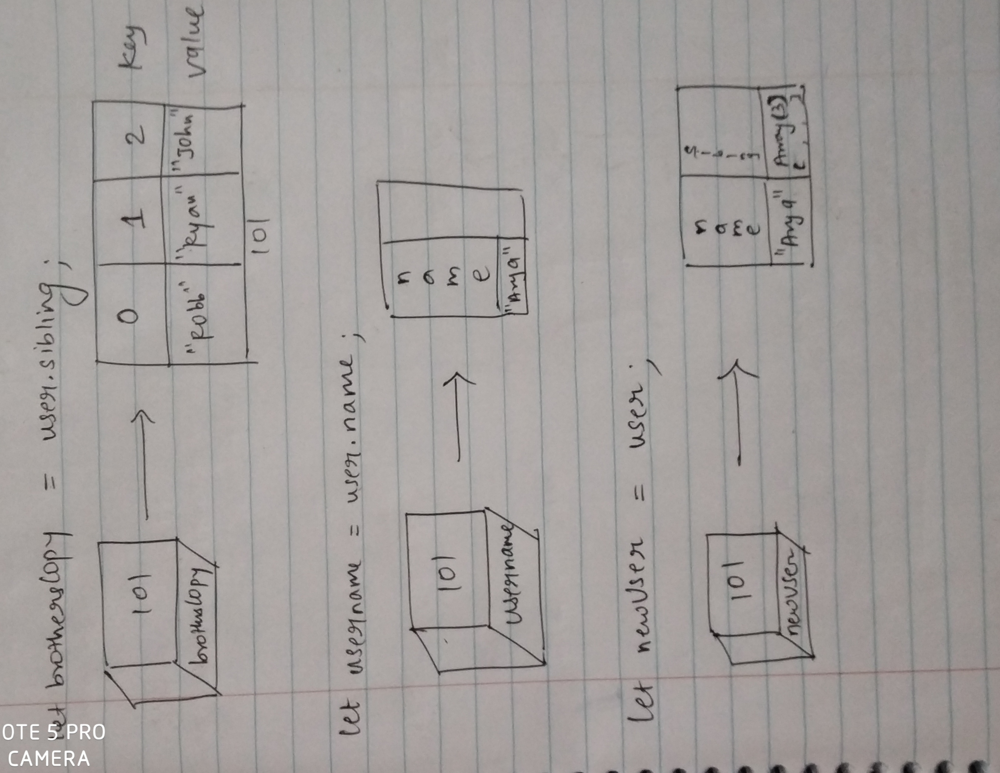

```js
let user = {
  name: 'Arya',
  sibling: ['Robb', 'Ryan', 'John'],
};
let allBrothers = ['Robb', 'Ryan', 'John'];
let brothersCopy = user.sibling;
let usename = user.name;
let newUser = user;
```

1. Memory representation

- Create the memory representation of the above snippet on notebook.
- Take a photo/screenshot and add it to the folder `code`

To add this image here use 



2. Answer the following with reason:

- `user == newUser;` // true. Because both point to the same memory location.
- `user === newUser;` // true. Because both point to the same memory location and have same type of data.
- `user.name === newUser.name;` // true. Because both point to the same memory location and have same type of data.
- `user.name == newUser.name;` // true. Because both point to the same memory location.
- `user.sibling == newUser.sibling;` //true. Because both point to the same memory location and have same type of data.
- `user.sibling === newUser.sibling;` //true.  Because both point to the same memory location.
- `user.sibling == allBrothers;` // false. Because although they have same value, but they are different non-primitive type variables and will occupy different memory locations.
- `user.sibling === allBrothers;` // false. Same reason, and strict equals won't make a difference here.
- `brothersCopy === allBrothers;` // false. brothersCopy variable points to same address as user.siblings but, allBrothers variable is dirrerent and uses another memory location.
- `brothersCopy == allBrothers;` // false. 
- `brothersCopy == user.sibling;` // true.
- `brothersCopy === user.sibling;` // true.
- `brothersCopy[0] === user.sibling[0];` // true. Both point to the same address location and will have the same array value.
- `brothersCopy[1] === user.sibling[1];` // true.
- `user.sibling[1] === newUser.sibling[1];` // true. newUser points to user's memory address location and will have same array value. Its copy by reference.
