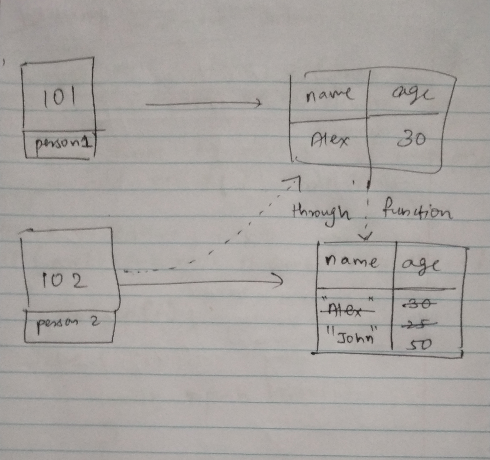

1. What will be the output and explain the reason.

```js
let obj = { name: 'Arya' };
obj = { surname: 'Stark' };
let newObj = { name: 'Arya' };
let user = obj;
let arr = ['Hi'];
let arr2 = arr;
```

Answer the following with reason after going through the above code:

- `[10] === [10]` // false. Since 10 is given inside an array, each [10] occupies a separate memory locatiin as it is a non-primitive data type.
- What is the value of obj? // {surname: "Stark"} - since we are creating a new object named obj for the second time it will create a new memory location and store the key-value pair assigned to it. `obj` variable created for the second time overwrites the first time created obj variable.
- `obj == newObj` // false. Since newObj is a newly created variable which contains non-primitive data type value so it will create a separate memory location and store it. 
- `obj === newObj` //false
- `user === newObj` // false. Since user is pointing to the same memory location as obj not of newObj.
- `user == newObj` // false.
- `user == obj` // true. since user and obj are pointing to the same memory location their value will be copied by reference.
- `arr == arr2` // true. Same reason as they are copy by reference. arr and arr2 both point to the same memory location and will contain ['Hi']. 
- `arr === arr2` // true.

2. What's will be the value of `person1` and `person2` ? Explain with reason. Draw the memory representation diagram.

To add this image here use 

```js
function personDetails(person) {
  person.age = 25;
  person = { name: 'John', age: 50 };
  return person;
}
var person1 = { name: 'Alex', age: 30 };
var person2 = personDetails(person1);
console.log(person1); // {name: "Alex", age: 25}
console.log(person2); // {name: "John", age: 50}
```
The memory diagram is added above. As Shown, firstly, person1 variable will create a new memory location say 101, and store its object value there. Later when person2 is created, the function personDetails will be called and as it accepts a parameter `person`, here we have passed the variable person1 through person parameter. So the person1's object will be passed to the function and this object's age will be updated first to 25 and later, both name and age will be updated to `John` and `50` and this will be returned. Therefore person2 will create a fresh memory location as it is a new variable and has a value of non-primitive type, and store the value there.  


3. What will be the output of the below code:

```js
var brothers = ['Bran', 'John'];
var user = {
  name: 'Sansa',
};
user.brothers = brothers;
brothers.push('Robb');
console.log(user.brothers === brothers); //1. output
console.log(user.brothers.length === brothers.length); //2. output
```
